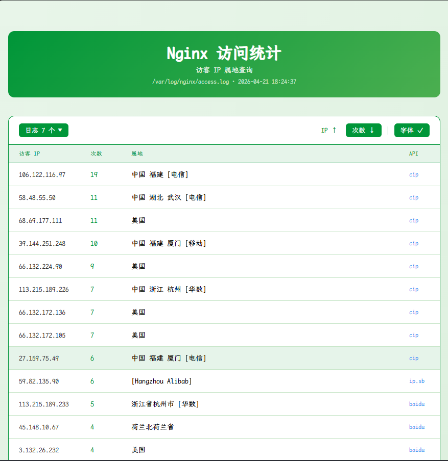

# Nginx 访问统计

Nginx access log 统计工具，查询访客 IP 属地并展示排行榜。

[](https://github.com/VincentZyuApps/nginx-report)
[](https://gitee.com/vincent-zyu/nginx-report)
[](https://hub.docker.com/r/vincentzyu233/nginx-report)

[](https://hub.docker.com/r/vincentzyu233/nginx-report)
[](https://github.com/VincentZyuApps/nginx-report/actions/workflows/build.yml)

## Python 版本

### 快速开始

```bash
# clone repo
git clone https://github.com/VincentZyuApps/nginx-report
# 或者从gitee
git clone https://gitee.com/vincent-zyu/nginx-report.git
cd py

# 使用uv创建虚拟环境(推荐)
# https://docs.astral.sh/uv/getting-started/installation/
# https://gitee.com/wangnov/uv-custom/releases
uv venv --python 3.13
# 安装依赖
uv pip install -r requirements.txt
# 运行
uv run python main.py
```

服务启动后访问 `http://{你的ip}:60418`

### 配置

修改 `main.py` 中的路径：

```python
LOG_DIR = "/var/log/nginx"  # Nginx 日志目录（支持 access.log 及轮转日志）
DB_FILE = "data/data.db"    # SQLite 数据库路径
```

---

## Go 版本

### Docker 运行

```bash
# 基础运行（容器删除后数据丢失）
docker run -d --name nginx-report -p 60419:60419 -v /var/log/nginx:/var/log/nginx:ro vincentzyu233/nginx-report:latest
# china mainlan user can use DaoCloud image:
docker run -d --name nginx-report -p 60419:60419 -v /var/log/nginx:/var/log/nginx:ro m.daocloud.io/docker.io/vincentzyu233/nginx-report:latest 
# 如果你想做数据持久化
docker run -d --name nginx-report -p 60419:60419 -v /var/log/nginx:/var/log/nginx:ro -v ./data:/app/data vincentzyu233/nginx-report:latest
```

然后访问 `http://{你的ip}:60419` 打开webui~

> **更新到最新镜像：**
> ```bash
> docker stop nginx-report && docker rm nginx-report
> docker pull vincentzyu233/nginx-report:latest
> # 重新运行，使用上面的相同参数
> docker run -d --name nginx-report -p 60419:60419 -v /var/log/nginx:/var/log/nginx:ro vincentzyu233/nginx-report:latest
> ```

> 手动配置docker镜像源:
> ```bash
> nano /etc/docker/daemon.json
> ```
> ```json
> { "registry-mirrors": ["https://docker.1ms.run"] }
> ```
> ```bash
> systemctl restart docker
> ```

### 环境变量

> Docker 建议使用 `-v` 持久化数据，而非环境变量。

| 变量 | 默认值 | 说明 |
|------|--------|------|
| `DB_PATH` | `data/data.db` | SQLite 数据库路径（容器内路径） |

### 本地编译

```bash
cd go

# 下载依赖
go mod download

# 编译
CGO_ENABLED=1 go build -o server .

# 运行
./server
# 如果你想做数据持久化 可以传入环境变量:
DB_PATH=/custom/path/data.db ./server
```

### Docker Compose

```bash
# 启动
docker compose up -d

# 查看日志
docker compose logs -f

# 更新到最新镜像：拉取最新镜像，然后重新创建并启动容器（使用新配置/新镜像，如果有更新的话）
docker compose pull && docker compose up -d
```

```yaml
version: '3'
services:
  nginx-report:
    container_name: nginx-report
    image: vincentzyu233/nginx-report:latest
    ports:
      - "60419:60419"
    volumes:
      - /var/log/nginx:/var/log/nginx:ro
      # - ./data:/app/data  # 取消注释以持久化数据库
    restart: unless-stopped
```

---

## 效果预览

## Python 版本 WebUI 预览

